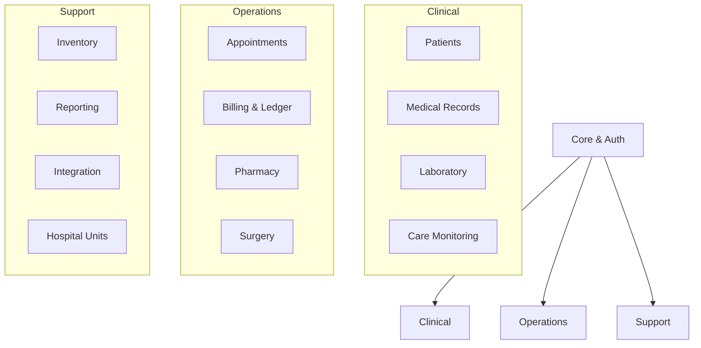
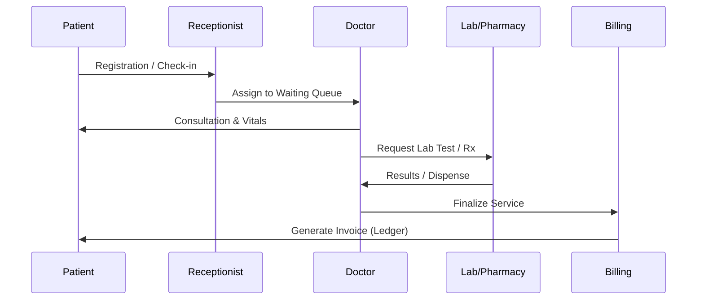

# Remedium Hospital Management System (HMS)

<div align="center">


**An Enterprise-Grade, HIPAA-Ready Modular Monolith for Modern Healthcare.**

[](https://www.djangoproject.com/)
[](https://www.python.org/)
[](https://www.django-rest-framework.org/)
[](https://github.com/neoastra303/Remedium-HMS)
[](https://github.com/neoastra303/Remedium-HMS)
[](https://github.com/neoastra303/Remedium-HMS)

[**Explore API Docs**](http://localhost:8000/api/v1/docs/) • [**Quick Start**](#-quick-start) • [**Role Dashboards**](#-intelligent-role-dashboards) • [**Architecture**](#-architectural-vision)

</div>

---

## 💎 The Remedium Difference

Remedium-HMS is not just another CRUD app. It is a high-security, auditable, and modular enterprise platform designed to handle the complexities of modern hospital operations.

### **🛡️ Security-First Core**
*   **PHI Encryption at Rest:** Sensitive Patient Health Information (Phone, Email, Medical History) is encrypted at the database layer using industry-standard Fernet symmetric encryption.
*   **Immutable Audit Trails:** Powered by `simple-history`, every clinical change is tracked. Soft-delete logic ensures records are never lost, only archived for legal compliance.
*   **Granular RBAC:** 13 distinct user roles with 8 tailored dashboards ensure clinical staff see what they need, while administrative staff manage what they must.

### **🏥 Clinical Excellence**
*   **OpenFDA Integration:** Real-time drug information and adverse event tracking via the official FDA API.
*   **Intelligent Care Monitoring:** Vital signs visualization with BMI calculation and critical condition flagging.
*   **Conflict-Aware Scheduling:** Smart appointment engine that prevents doctor double-booking and respects work shifts.

### **✨ Glassmorphic UI/UX**
*   A premium, modern interface utilizing **Backdrop Blurs**, **Staggered Animations**, and **Shimmer Skeletons** to provide a fluid, "living" application feel that moves beyond standard Bootstrap.

---

## 🏗️ Architectural Vision

Remedium follows a **Modular Monolith** pattern, keeping the codebase manageable through 14 specialized Django apps while ensuring unified performance.



### **🔄 Clinical Workflow**



---

## 🎨 System Wireframes & Dashboards

Remedium features a **Glassmorphic Design System** that adapts to the user's role.

<div align="center">

| **Clinical Dashboard** | **Administrative View** |
|:---:|:---:|
|  |  |
| *Focus: Patient Vitals & Today's Schedule* | *Focus: Revenue & Dept Occupancy* |

| **Pharmacy Portal** | **Laboratory Console** |
|:---:|:---:|
|  |  |
| *Focus: Stock Alerts & Rx Dispensing* | *Focus: Test Queue & Result Entry* |

</div>

---

## 📊 Tech Stack

| Layer | Technology |
|---|---|
| **Backend** | Django 5.2.14, Python 3.13, DRF 3.16 |
| **Database** | SQLite (Dev) • PostgreSQL (Prod) • PHI Encryption |
| **Frontend** | Bootstrap 5.3, Custom Glassmorphism, Chart.js, Vanilla JS/jQuery |
| **DevOps** | Docker (Non-Root), Gunicorn, WhiteNoise, GitHub Actions |
| **API Docs** | OpenAPI 3.0 (Swagger UI + ReDoc) |
| **Integrations** | OpenFDA API, SMTP Console/Gmail |

---

## 👥 Intelligent Role Dashboards

Each role is granted unique permissions and a specialized landing page.

| Role | Interface | Key Features |
|:---:|:---|---|
| **Doctor** | `doctor_dashboard.html` | Schedule, active patients, vitals visualization, rapid Rx. |
| **Nurse** | `nurse_dashboard.html` | Ward tracking, vitals log, admission management. |
| **Admin** | `admin_dashboard.html` | Revenue analytics, department load, staff management. |
| **Pharmacist** | `pharmacist_dashboard.html` | Stock alerts, Rx queue, OpenFDA lookups. |
| **Reception** | `reception_dashboard.html` | Check-in queue, billing flow, doctor availability. |

### **🔐 Test Accounts (Demo Seeding)**

Run `python manage.py create_role_users` to explore the system with any of these pre-configured roles:

| Username | Role | Dashboard Access | Password |
|:---|:---|:---|:---|
| `admin` | Administrator | Full Analytics & Operations | `password123` |
| `doctor` | Doctor | Clinical Consultation & vitals | `password123` |
| `nurse` | Nurse | In-patient monitoring | `password123` |
| `pharmacist` | Pharmacist | Inventory & OpenFDA Portal | `password123` |
| `labtech` | Lab Technician | Result Entry & Queue | `password123` |
| `receptionist` | Receptionist | Check-in & Ledger Billing | `password123` |

---

## 🚀 Quick Start

### 1. Setup Environment
```bash
git clone https://github.com/neoastra303/Remedium-HMS.git
cd Remedium-HMS
python -m venv venv
source venv/bin/activate  # venv\Scripts\activate on Windows
pip install -r requirements.txt
```

### 2. Initialize Database
```bash
python manage.py migrate
python manage.py create_groups  # Essential for RBAC
python manage.py create_role_users  # Optional: Seed test accounts
```

### 3. Launch
```bash
python manage.py runserver
```
Access at `http://localhost:8000`. Login with `admin` / `password123` if you seeded test accounts.

---

## 📡 API Ecosystem

All endpoints are versioned under `/api/v1/`.

*   **Swagger UI:** `/api/v1/docs/`
*   **ReDoc:** `/api/v1/redoc/`
*   **Auth:** JWT-based or Token-based headers.

**Key Endpoint Groups:**
*   `/patients/` — Demographics & Discharge logic.
*   `/prescriptions/` — Rx management + OpenFDA search.
*   `/invoices/` — Ledger-based billing.

---

## 🧪 Quality Assurance

We maintain a high bar for reliability:
```bash
python -m pytest --cov=. --cov-report=term-missing
```
**Current Status:** 113+ Tests • 83% Coverage • Zero Critical Vulnerabilities.

---

## 🤝 Contributing & Support

We welcome contributions! Please see [CONTRIBUTING.md](CONTRIBUTING.md) and [SECURITY.md](SECURITY.md).

**Remedium HMS** — *Empowering Healthcare, One System at a Time.*

Built with ❤️ by [neoastra303](https://github.com/neoastra303)
