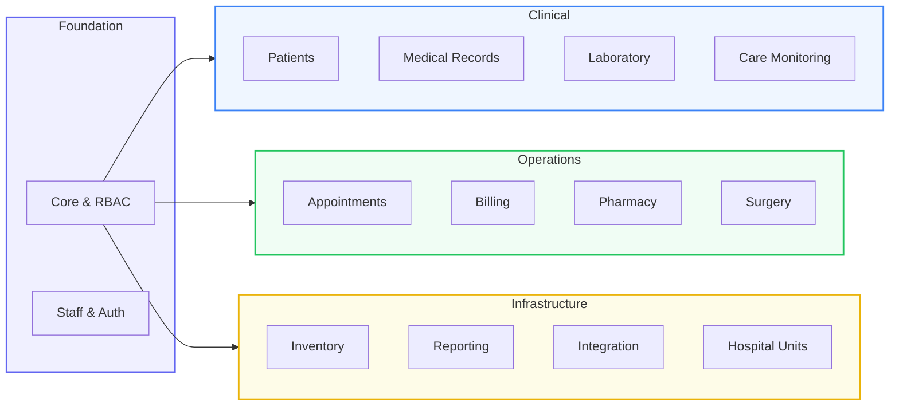
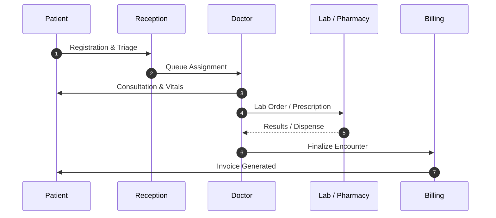
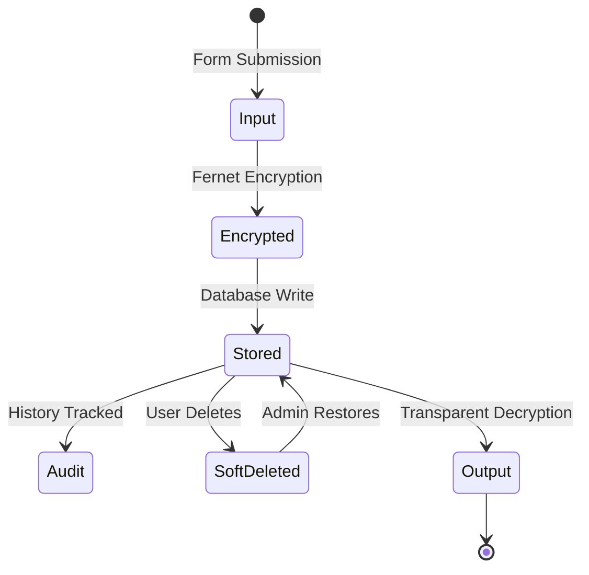

<div align="center">


# Remedium HMS

### Enterprise Hospital Management System

**An open-source, HIPAA-ready modular monolith built for modern healthcare teams.**

---

[](https://www.djangoproject.com/)
[](https://www.python.org/)
[](https://www.django-rest-framework.org/)
[](LICENSE)
[](#testing)
[](#testing)

<br />

[Quick Start](#-quick-start) &nbsp;&bull;&nbsp; [Features](#-features) &nbsp;&bull;&nbsp; [Architecture](#-architecture) &nbsp;&bull;&nbsp; [API Docs](#-api) &nbsp;&bull;&nbsp; [Contributing](#-contributing)

</div>

---

## Overview

Remedium HMS is a full-featured hospital management platform designed to handle the real complexities of healthcare operations — from patient admission to discharge, pharmacy dispensing, lab testing, surgery scheduling, and revenue tracking.

**What makes it different:**

- **Security-first** — PHI encrypted at rest with Fernet, immutable audit trails, granular RBAC across 13 roles
- **Clinical-grade** — Conflict-aware scheduling, vital signs monitoring, OpenFDA drug lookup
- **Production-ready** — Dockerized, PostgreSQL-compatible, JWT auth, OpenAPI docs
- **Beautiful UI** — Glassmorphic design system with dark mode, animations, and mobile-first responsive layout

---

## Features

<table>
<tr>
<td width="50%" valign="top">

#### Patient Management
- Full lifecycle from admission to discharge
- Encrypted PHI (phone, email, medical history)
- Insurance tracking and emergency contacts

#### Smart Scheduling
- Conflict-aware appointment engine
- Prevents double-booking automatically
- Respects doctor shifts and availability

#### Pharmacy & Inventory
- Real-time stock tracking with reorder alerts
- OpenFDA drug information integration
- Prescription queue with dispense tracking

</td>
<td width="50%" valign="top">

#### Revenue Analytics
- Immutable ledger-based billing system
- Revenue dashboards with trend charts
- Unpaid invoice tracking and reporting

#### Care Monitoring
- Vital signs visualization with charts
- BMI calculation and critical flagging
- Real-time patient status dashboard

#### Laboratory
- Test queue management with priority
- Critical range flagging on results
- Automated lab order processing

</td>
</tr>
</table>

---

## Architecture

Remedium follows a **Modular Monolith** pattern with strict domain boundaries across 14 specialized apps.



### The Patient Journey



### Security Lifecycle



---

## Role Dashboards

Each role gets a purpose-built interface with the data and tools they need.

| Role | Dashboard | What You See |
|:-----|:----------|:-------------|
| **Admin** | Revenue charts, department load, staff management, audit logs |
| **Doctor** | Daily schedule, patient vitals, prescriptions, surgery tracking |
| **Nurse** | Ward overview, critical patients, vitals logging, bed map |
| **Surgeon** | Surgery schedule, pre-op count, upcoming procedures |
| **Pharmacist** | Rx queue, stock alerts, OpenFDA lookup, dispense tracking |
| **Lab Tech** | Test queue, result entry, critical flagging, completed tests |
| **Receptionist** | Check-in queue, billing, doctor availability, registration |

---

## Tech Stack

| Layer | Technology |
|:------|:-----------|
| **Backend** | Django 5.2, Python 3.13, Django REST Framework 3.16 |
| **Database** | PostgreSQL (prod) / SQLite (dev) |
| **Auth** | JWT tokens, token blacklist, role-based access control |
| **Frontend** | Bootstrap 5.3, custom glassmorphism CSS, Chart.js, vanilla JS |
| **Security** | Fernet PHI encryption, CSRF protection, login throttling |
| **DevOps** | Docker (non-root), Gunicorn, WhiteNoise, GitHub Actions |
| **API** | OpenAPI 3.0 with Swagger UI and ReDoc |

---

## Quick Start

### 1. Clone & Install

```bash
git clone https://github.com/neoastra303/Remedium-HMS.git
cd Remedium-HMS
python -m venv venv
source venv/bin/activate  # Windows: venv\Scripts\activate
pip install -r requirements.txt
```

### 2. Initialize

```bash
python manage.py migrate
python manage.py create_groups       # RBAC roles
python manage.py create_role_users   # Demo accounts (optional)
```

### 3. Run

```bash
python manage.py runserver
```

Open **http://localhost:8000** and sign in with `admin` / `password123`.

---

## API

All endpoints are versioned under `/api/v1/`.

| Endpoint | Description |
|:---------|:------------|
| `/api/v1/patients/` | Patient demographics and management |
| `/api/v1/appointments/` | Scheduling and conflict detection |
| `/api/v1/prescriptions/` | Rx management with OpenFDA lookup |
| `/api/v1/invoices/` | Ledger-based billing |
| `/api/v1/staff/` | Staff profiles and role management |
| `/api/v1/lab-tests/` | Laboratory test orders and results |
| `/api/v1/surgeries/` | Surgery scheduling and tracking |
| `/api/v1/inventory/` | Pharmacy and supply inventory |

**Interactive docs:**
- Swagger UI: `/api/v1/docs/`
- ReDoc: `/api/v1/redoc/`

---

## Testing

```bash
# Run all tests
python manage.py test

# With coverage
pip install pytest-cov
pytest --cov=. --cov-report=term-missing
```

**Current status:** 113+ tests, 83% coverage, zero critical vulnerabilities.

---

## Project Structure

```
Remedium-HMS/
├── core/                   # Platform foundation, RBAC, API utilities
├── patients/               # Patient lifecycle and demographics
├── appointments/           # Scheduling engine with conflict detection
├── billing/                # Ledger-based invoicing and payments
├── pharmacy/               # Prescriptions and OpenFDA integration
├── laboratory/             # Test orders, results, critical flagging
├── care_monitoring/        # Vital signs and patient monitoring
├── surgery/                # Surgery scheduling and tracking
├── inventory/              # Supply chain and stock management
├── staff/                  # Staff profiles, shifts, and roles
├── medical_records/        # Encounters and clinical documents
├── reporting/              # Analytics and custom reports
├── integration/            # Third-party API integrations
├── hospital/               # Wards, rooms, beds, and services
├── notifications/          # SMS, Email, WhatsApp notifications
├── templates/              # Shared templates and partials
├── static/                 # CSS, JS, and assets
├── remedium_hms/           # Project settings and configuration
├── docs/                   # Documentation
└── design/                 # Logo and prototypes
```

---

## Contributing

Contributions are welcome! Please read:

- [Contributing Guide](CONTRIBUTING.md)
- [Security Policy](SECURITY.md)
- [Changelog](CHANGELOG.md)

---

## License

This project is licensed under the MIT License — see [LICENSE](LICENSE) for details.

---

<div align="center">

**Built with Django & Python**

[neoastra303](https://github.com/neoastra303)

</div>
